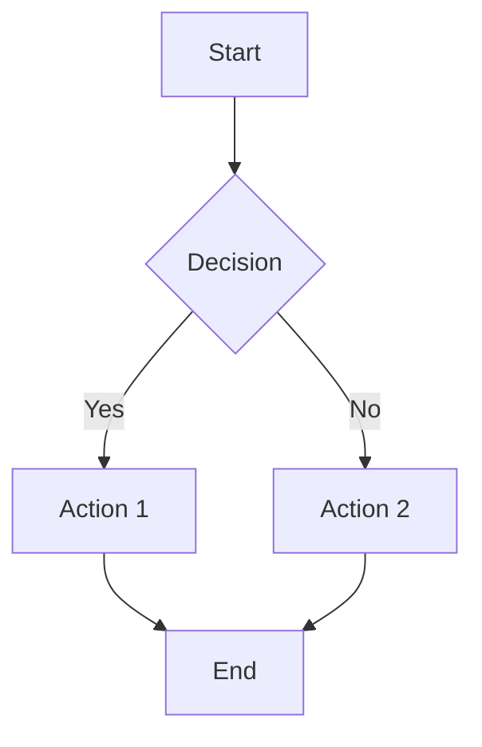

# Excalidraw Integration

Generate hand-drawn style diagrams using two approaches: Mermaid conversion (official tool) and direct JSON generation.

## Overview

This integration provides tools to generate Excalidraw diagrams without requiring an MCP server. It supports:
- **Approach 1**: Mermaid → Excalidraw (official conversion tool)
- **Approach 2**: Direct JSON generation (full control)

## Why No MCP?

While community MCP servers exist, this approach provides:
- ✅ **Official tools**: Uses Excalidraw's official `@excalidraw/mermaid-to-excalidraw`
- ✅ **Zero external dependencies**: No third-party MCP servers
- ✅ **Full control**: Direct JSON manipulation for custom needs
- ✅ **Security**: No untrusted code execution

## Prerequisites

- Node.js 14+ installed
- Claude Code (for Mermaid generation)
- Excalidraw (for viewing .excalidraw files)

## Installation

```bash
cd integrations/excalidraw
npm install
```

This installs the official `@excalidraw/mermaid-to-excalidraw` package.

## Quick Start

### Approach 1: Mermaid → Excalidraw (Recommended for Flowcharts)

1. **Generate Mermaid diagram** (Claude Code is excellent at this):



2. **Save to file**:
```bash
echo "graph TD
    A[Start] --> B{Decision}
    B -->|Yes| C[Action 1]
    B -->|No| D[Action 2]
    C --> E[End]
    D --> E" > diagram.mmd
```

3. **Convert to Excalidraw**:
```bash
node integrations/excalidraw/mermaid-to-excalidraw.js diagram.mmd diagram.excalidraw
```

4. **Open in Excalidraw**:
```bash
open diagram.excalidraw
```

### Approach 2: Direct JSON Generation

For diagram types not supported by Mermaid (architecture diagrams, mind maps, UML), use JSON templates:

```bash
# Copy a template
cp integrations/excalidraw/templates/architecture.json my-diagram.excalidraw

# Edit the JSON (Claude Code can help modify it)
# Then open in Excalidraw
open my-diagram.excalidraw
```

## Supported Diagram Types

| Type | Method | Notes |
|------|--------|-------|
| **Flowcharts** | Mermaid → Excalidraw | Fully supported, hand-drawn style |
| **Architecture** | JSON templates | Use architecture.json template |
| **Mind Maps** | JSON templates | Use mindmap.json template |
| **UML Class** | JSON templates | Use uml-class.json template |
| **Sequence** | Mermaid → Excalidraw | Currently renders as image |
| **Other** | JSON templates | Create custom JSON |

## Usage Examples

### Example 1: System Architecture Diagram

```bash
# 1. Ask Claude to generate architecture based on template
Read integrations/excalidraw/templates/architecture.json

# 2. Claude modifies the JSON with your components
Write my-architecture.excalidraw '{...modified JSON...}'

# 3. Open in Excalidraw
open my-architecture.excalidraw
```

### Example 2: Mind Map

```bash
# 1. Use mind map template
cp integrations/excalidraw/templates/mindmap.json brainstorm.excalidraw

# 2. Edit with Claude Code's help
Read brainstorm.excalidraw
# Claude suggests modifications...
Edit brainstorm.excalidraw ...

# 3. Open
open brainstorm.excalidraw
```

### Example 3: UML Class Diagram

```bash
# 1. Copy UML template
cp integrations/excalidraw/templates/uml-class.json classes.excalidraw

# 2. Claude generates class structure
# Based on your code or requirements

# 3. View result
open classes.excalidraw
```

## Tools Reference

### mermaid-to-excalidraw.js

Converts Mermaid diagrams to Excalidraw format using the official tool.

**Usage**:
```bash
node mermaid-to-excalidraw.js <input.mmd> <output.excalidraw>
```

**Arguments**:
- `input.mmd` - Mermaid diagram file
- `output.excalidraw` - Output Excalidraw file

**Example**:
```bash
node mermaid-to-excalidraw.js flowchart.mmd flowchart.excalidraw
```

## Templates

See [templates/README.md](./templates/README.md) for details on each template and how to customize them.

Available templates:
- `architecture.json` - System architecture diagrams
- `mindmap.json` - Mind maps and brainstorming
- `uml-class.json` - UML class diagrams

## Excalidraw JSON Format

Excalidraw files use a JSON format:

```json
{
  "type": "excalidraw",
  "version": 2,
  "source": "https://excalidraw.com",
  "elements": [
    {
      "type": "rectangle",
      "x": 100,
      "y": 100,
      "width": 200,
      "height": 100,
      "strokeColor": "#000000",
      "backgroundColor": "transparent"
    }
  ],
  "appState": {
    "gridSize": 20,
    "viewBackgroundColor": "#ffffff"
  }
}
```

See templates for more complex examples.

## Claude Code Integration

### Workflow 1: Mermaid Generation
```
1. User: "Create a flowchart for user authentication"
2. Claude generates Mermaid syntax
3. Claude saves to .mmd file
4. Claude runs conversion script
5. Claude opens in Excalidraw
```

### Workflow 2: JSON Modification
```
1. User: "Create an architecture diagram with API, Database, and Frontend"
2. Claude reads architecture.json template
3. Claude modifies JSON to match requirements
4. Claude saves modified JSON
5. Claude opens in Excalidraw
```

## Tips & Best Practices

### For Mermaid Approach
- ✅ Best for flowcharts and simple diagrams
- ✅ Let Claude generate Mermaid (it's very good at it)
- ✅ Use official tool for guaranteed compatibility

### For JSON Approach
- ✅ Best for complex layouts
- ✅ Use templates as starting point
- ✅ Ask Claude to modify specific elements
- ✅ Keep element IDs unique

### General
- 📐 Use grid size of 20 for alignment
- 🎨 Stick to default colors for consistency
- 💾 Save frequently while editing
- 🔄 Version control your .excalidraw files

## External Integration

Other projects can use these tools:

1. **Copy this directory**:
   ```bash
   cp -r integrations/excalidraw /path/to/your/project/
   ```

2. **Install dependencies**:
   ```bash
   cd /path/to/your/project/excalidraw
   npm install
   ```

3. **Use the tools** as documented above

## Troubleshooting

### Conversion Script Fails
```bash
# Verify Node.js version
node --version  # Should be 14+

# Reinstall dependencies
rm -rf node_modules package-lock.json
npm install
```

### Invalid Mermaid Syntax
```bash
# Test Mermaid syntax online first
# https://mermaid.live/
```

### JSON Validation Errors
```bash
# Validate JSON
python3 -m json.tool my-diagram.excalidraw

# Or use jq
jq . my-diagram.excalidraw
```

### Excalidraw Won't Open File
- Verify file extension is `.excalidraw`
- Check JSON is valid
- Ensure `type: "excalidraw"` field exists

## Limitations

### Mermaid Approach
- ⚠️ Currently only flowcharts get full hand-drawn conversion
- ⚠️ Other diagram types render as images
- ⚠️ Limited customization options

### JSON Approach
- ⚠️ Requires understanding JSON structure
- ⚠️ Manual coordinate calculation
- ⚠️ No auto-layout (yet)

## Advanced: Creating Custom Templates

See templates/README.md for guide on creating your own templates.

## See Also

- [templates/README.md](./templates/README.md) - Template documentation
- [Official Excalidraw Docs](https://docs.excalidraw.com/)
- [Mermaid Documentation](https://mermaid.js.org/)
- [@excalidraw/mermaid-to-excalidraw](https://www.npmjs.com/package/@excalidraw/mermaid-to-excalidraw)
